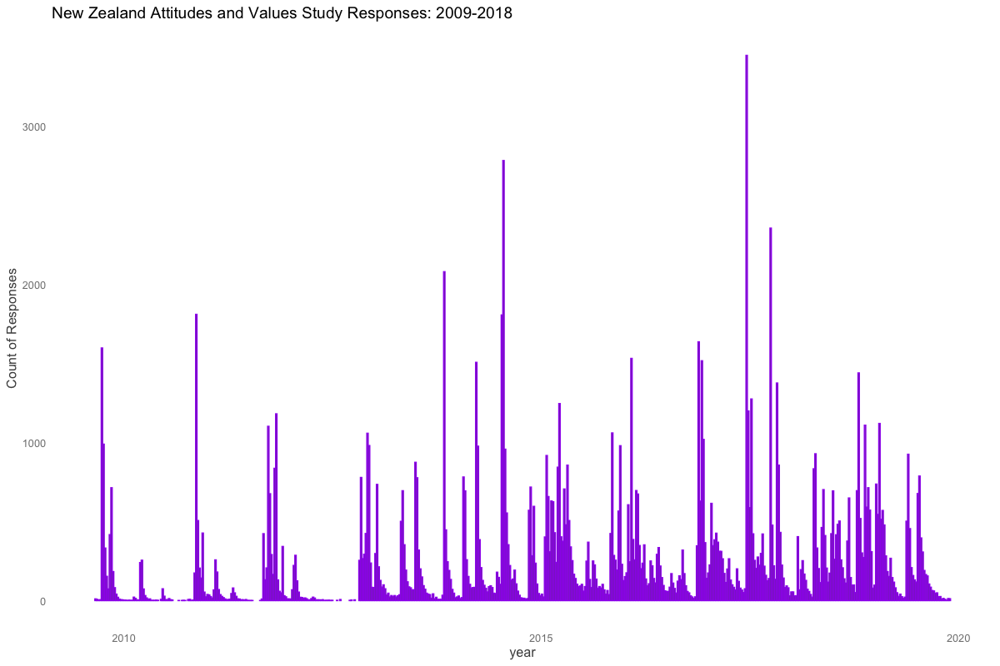

```{r global_options,  include = FALSE}
knitr::opts_chunk$set(message=FALSE, 
                      warning=FALSE,
                      collapse =TRUE,
                      echo=FALSE)
                      #results="hide", 
                     # fig.width= 10,
                     # fig.height=8)
# read libraries
```
```{r sourcelibraries, include=FALSE}
source("libs.R")
source("funs.R") # custom functions for analysis
```
```{r readdata, include = FALSE, cache = TRUE }
# read data
d <- data_read()

# take longitudinal cases (i.e more than one response)
dom <- data_take_longitudinal_cases( d )

# label changes
dom$Your_Future_Security <- dom$SWB.SatPWI03
dom$MostNZPoliciesServeGrGood <- dom$SysJust04
dom$Religious <-
  factor(dom$Religious, labels = c("Not_Religious", "Religious"))

table1::label(dom$Env.ClimateChgReal) <- "Climate Change Reality"
table1::label(dom$Env.ClimateChgCause) <-"Humans Cause Climate Change"
table1::label(dom$EnvEfficacy) <- "Human Efficacy"
table1::label(dom$Env.SacMade) <- "Sacrificed for Environment"
table1::label(dom$Env.SacWilling) <- "Willing to Sacrifice Environment"
table1::label(dom$Env.MotorwaySpend) <- "Gov Motorway Spend"
table1::label(dom$Env.PubTransSubs) <- "Gov Subsidy Public Transport"
table1::label(dom$Env.NATIVE.SPECIES) <- "Protect NZ Species"
table1::label(dom$Env.SatNZEnvironment) <- "Sat Quality NZ Environment"
table1::label(dom$Env.ClimateChgConcern) <- "Deeply Concerned About Climate"

# reference here: https://easystats.github.io/parameters/reference/demean.html
# demean variablles
dom <- cbind(
  dom,
  demean(dom, select = c("Env.ClimateChgConcern", "Your_Future_Security", "Env.SatNZEnvironment","EnvEfficacy","Env.ClimateChgCause","Env.ClimateChgReal", "Relid", "PoliticalConservativism",   "Env.SacWilling", "Env.SacMade",  "Your_Future_Security"), group = "Id"
))

dom <- dom %>% 
  dplyr::mutate(
    Relid_betweenC = scale(Relid_between, center = TRUE, scale = FALSE),
    PoliticalConservativism_betweenC = scale(PoliticalConservativism_between, center = TRUE, scale = FALSE),
    Your_Future_Security_betweenC = scale( Your_Future_Security_between, center = TRUE, scale = FALSE),
    yearsC = scale(years, center = TRUE, scale = FALSE)  )
```


```{r models, include = FALSE , cache = TRUE}

# # initial analysis
# mt <-
#   lmer(Env.ClimateChgConcern ~ years * (Your_Future_SecurityS + K6S) + (1 |
#                                                                            Id),
#        data = dom)

# climate beliefs 
# climate change is real
cb1_p <-lmer(Env.ClimateChgReal ~ yearsC *  PoliticalConservativism_betweenC + PoliticalConservativism_within +  (1 + PoliticalConservativism_betweenC|Id) +  (PoliticalConservativism_within|Id), 
           data = dom)
cb1_r<- lmer(Env.ClimateChgReal ~ yearsC *  Relid_betweenC +  Relid_within + (1 + Relid_betweenC|Id) +  (Relid_within|Id), 
           data = dom)

# climate change is human caused
cb2_p <-lmer(Env.ClimateChgCause ~ yearsC *  PoliticalConservativism_betweenC + PoliticalConservativism_within +  (1 + PoliticalConservativism_betweenC|Id) +  (PoliticalConservativism_within|Id), 
           data = dom)
cb2_r<- lmer(Env.ClimateChgCause ~ yearsC *  Relid_betweenC +  Relid_within + (1 + Relid_betweenC|Id) +  (Relid_within|Id), 
           data = dom)


# "I am deeply concerned about climate change."

cc2_p <-lmer(Env.ClimateChgConcern ~ yearsC *  PoliticalConservativism_betweenC + PoliticalConservativism_within +  (1 + PoliticalConservativism_betweenC|Id) +  (PoliticalConservativism_within|Id), 
           data = dom)
cc2_r<- lmer(Env.ClimateChgConcern ~ yearsC *  Relid_betweenC +  Relid_within + (1 + Relid_betweenC|Id) +  (Relid_within|Id), 
           data = dom)

#"By taking personal action I believe I can make a positive difference to environmental problems."
#"I feel I can make a difference to the state of the environment."
ee_p <-lmer(EnvEfficacy ~ yearsC *  PoliticalConservativism_betweenC + PoliticalConservativism_within +  (1 + PoliticalConservativism_betweenC|Id) +  (PoliticalConservativism_within|Id), 
           data = dom)
ee_r<- lmer(EnvEfficacy ~ yearsC *  Relid_betweenC +  Relid_within + (1 + Relid_betweenC|Id) +  (Relid_within|Id), 
           data = dom)

##"Have you made sacrifices to your standard of living (e.g., accepted higher prices, driven less, conserved energy) in order to protect the environment?"
es_p <-lmer(Env.SacMade ~ yearsC *  PoliticalConservativism_betweenC + PoliticalConservativism_within +  (1 + PoliticalConservativism_betweenC|Id) +  (PoliticalConservativism_within|Id), 
           data = dom)
es_r<- lmer(Env.SacMade ~ yearsC *  Relid_betweenC +  Relid_within + (1 + Relid_betweenC|Id) +  (Relid_within|Id), 
           data = dom)
```


## What is the New Zealand Attitudes and Values Study (NZAVS)?

  - Planned 20-year longitudinal study, currently in its 11$^{th}$ year.
    
  - Postal questionnaire.
    
  - Sample frame drawn randomly from NZ Electoral Roll.
    
  - Large multidisciplinary research team.
    
  - Focus on personality, social attitudes, values, religion, adult character development, identity, employment, experiences of discrimination, well-being and health, and environmental attitudes ...
    
  - Current sample contains $>42,000$ unique people, or $1.45\%$ of the adult NZ population.
    
  - Here, we draw on  $N = 26,790$ longitudinal participants who responded to two or more waves from 2009 -- 2018

##

```{r}

```


## Here, we investigate

  1. Climate Beliefs
  
  2. Climate Concern
  
  3. Beliefs my behaviour can make a difference 
  
  4. Sacrificial Behaviour for the Environment 

## Model Form {.footnotesize}

```{r, include =FALSE, cache = TRUE}
# for mod equation
d2<- dom %>% 
    dplyr::mutate(
    outcome = Env.ClimateChgReal,
    Rel_win = Relid_within,
    Rel_betw = Relid_betweenC
    )
eqa<- lmer(outcome ~ years *  Rel_betw +  Rel_win + (1 + Rel_betw|Id) +  (Rel_win|Id), 
           data = d2)
```
```{r modelequation}
equatiomatic::extract_eq(eqa, wrap = TRUE,  terms_per_line = 3)
```


## Climate Beliefs

"Climate change is real."


## Climate change is real: political conservativism between 


```{r cb1_p, cache = TRUE}
plot(ggpredict(
  cb1_p,
  terms = c( "yearsC","PoliticalConservativism_betweenC [minmax]"),
)) + scale_y_continuous(limits= (c(3,8))) # 
```

## Climate change is real: political conservativism within 

```{r cb12, cache = TRUE}
plot(ggpredict(
  cb1_p,
  terms = c( "PoliticalConservativism_within [minmax]"),
)) + scale_y_continuous(limits= (c(3,8))) # 
```

## Climate change is real: religious identification between 

```{r cb13, cache = TRUE}
plot(ggpredict(
  cb1_r,
  terms = c( "yearsC","Relid_betweenC [minmax]"),
))  + scale_y_continuous(limits= (c(3,8))) # 
```

## Climate change is real: religious identification within 

```{r cb14, cache = TRUE}
plot(ggpredict(
  cb1_r,
  terms = c( "Relid_within [minmax]"),
)) + scale_y_continuous(limits= (c(3,8))) 
```

## Table of Religion Climate Reality Trend

```{r cb1T,cache = TRUE}
tab_model(cb1_r, show.r2 = FALSE )
```

## Beliefs in Human Caused Climate Change

> "Climate change is caused by humans."

## Climate change is human caused: political conservativism between 

```{r cb21, cache = TRUE}
plot(ggpredict(
  cb2_p,
  terms = c( "yearsC","PoliticalConservativism_betweenC [minmax]"),
)) + scale_y_continuous(limits= (c(3,8))) 
```

## Climate change is human caused: political conservativism within 

```{r cb22, cache = TRUE}
plot(ggpredict(
  cb2_p,
  terms = c( "PoliticalConservativism_within [minmax]"),
)) + scale_y_continuous(limits= (c(3,8))) 
```

## Climate change is human caused: religious identification between 

```{r cb23, cache = TRUE}
plot(ggpredict(
  cb2_r,
  terms = c( "yearsC","Relid_betweenC [minmax]"),
))  + scale_y_continuous(limits= (c(3,8))) 
```

## Climate change is human caused: religious identification within 

```{r cb2T4, cache = TRUE}
plot(ggpredict(
  cb2_r,
  terms = c( "Relid_within [minmax]"),
)) + scale_y_continuous(limits= (c(3,8))) 
```

## Climate Concern

> "I am deeply concerned about climate change."

## Table of Religion Climate is Human Caused Trend

```{r cb2T,cache = TRUE}
tab_model(cb2_r, show.r2 = FALSE )
```

## Climate change concern: political conservativism between 

```{r cc21, cache = TRUE}
plot(ggpredict(
  cc2_p,
  terms = c( "yearsC","PoliticalConservativism_betweenC [minmax]"),
)) + scale_y_continuous(limits= (c(2.5,8))) 
```

## Climate change is concern: political conservativism within 

```{r cc22, cache = TRUE}
plot(ggpredict(
  cc2_p,
  terms = c( "PoliticalConservativism_within [minmax]"),
)) + scale_y_continuous(limits= (c(2.5,8))) # USE # USE # USE# USE
```

## Climate change is concern: religious identification between 

```{r cc23, cache = TRUE}
plot(ggpredict(
  cc2_r,
  terms = c( "yearsC","Relid_betweenC [minmax]"),
))  + scale_y_continuous(limits= (c(2.5,8))) # USE # USE # USE# USE
```

## Climate change is concern: religious identification within 

```{r cc2T, cache = TRUE}
plot(ggpredict(
  cc2_r,
  terms = c( "Relid_within [minmax]"),
)) + scale_y_continuous(limits= (c(2.5,8))) # USE # USE # USE# USE
```

## Table of Religion & Climate Concern Trend

```{r cc2_rT,cache = TRUE}
tab_model(cc2_r, show.r2 = FALSE )
```

## Climate change efficacy beliefs: political conservativism between 

```{r ee_p1, cache = TRUE}
plot(ggpredict(
  ee_p,
  terms = c( "yearsC","PoliticalConservativism_betweenC [minmax]"),
)) + scale_y_continuous(limits= (c(4,6)))
```

## Climate Efficacy Beliefs 

- "By taking personal action I believe I can make a positive difference to environmental problems."

- "I feel I can make a difference to the state of the environment"

## Climate change efficacy beliefs: political conservativism within 

```{r ee_p2, cache = TRUE}
plot(ggpredict(
  ee_p,
  terms = c( "PoliticalConservativism_within [minmax]"),
))  + scale_y_continuous(limits= (c(4,6))) #
```

## Climate change efficacy beliefs: religious identification between 

```{r ee_p3, cache = TRUE}
plot(ggpredict(
  ee_r,
  terms = c( "yearsC","Relid_betweenC [minmax]"),
)) + scale_y_continuous(limits= (c(4,6))) #
```

## Climate change efficacy beliefs: religious identification within 

```{r ee_p4, cache = TRUE}
plot(ggpredict(
  ee_r,
  terms = c( "Relid_within [minmax]"),
))  + scale_y_continuous(limits= (c(4,6))) #
```

## Table of Religion & Climate Change Efficacy Beliefs

```{r ee_T,cache = TRUE}
tab_model(cc2_r , show.r2 = FALSE )
```

## Climate sacrifice behaviours

> "Have you made sacrifices to your standard of living (e.g., accepted higher prices, driven less, conserved energy) in order to protect the environment?"


## Climate sacrifice behaviours: political conservativism between 

```{r es1, cache = TRUE}
plot(ggpredict(
  es_p,
  terms = c( "yearsC","PoliticalConservativism_betweenC [minmax]"),
)) + scale_y_continuous(limits= (c(3.5,6))) #
```


## Climate change efficacy beliefs: political conservativism within 

```{r es2, cache = TRUE}
plot(ggpredict(
  es_p,
  terms = c( "PoliticalConservativism_within [minmax]"),
)) + scale_y_continuous(limits= (c(3.5,6))) #
```

## Climate sacrifice behaviours: religious identification between 

```{r es3, cache = TRUE}
plot(ggpredict(
  es_r,
  terms = c( "yearsC","Relid_betweenC [minmax]"),
)) + scale_y_continuous(limits= (c(3.5,6))) #
```

##  Climate sacrifice behaviours: religious identification within 

```{r es4, cache = TRUE}
plot(ggpredict(
  es_r,
  terms = c( "Relid_within [minmax]"),
)) + scale_y_continuous(limits= (c(3.5,6))) #
```

## Table of Religion & Climate Climate Sacrifice Behaviours:

```{r esT,cache = TRUE}
tab_model(es_r, show.r2 = FALSE)
```

## Summary and Questions

-  Compared with a decade ago, New Zealanders are substantially (1) more aware (2) more concerned about climate change.

-  Sacrificial behaviours have been slow to follow this concern

-  Question: though less believing of and concerned about climate change, religious people think they can make a difference: **can we tap this potential?**

-  Question:  Any hypotheses for the why the within_religious trend differs from  the between_religious trend?


## Thanks to

- Dom Johnson, Oxford University

- Chris G Sibley, Univerisity of Auckland

- Templeton Religion Trust Grant 0196

- You for your attention.

## 

```{r}
knitr::include_graphics("trtlogo.png")
```


